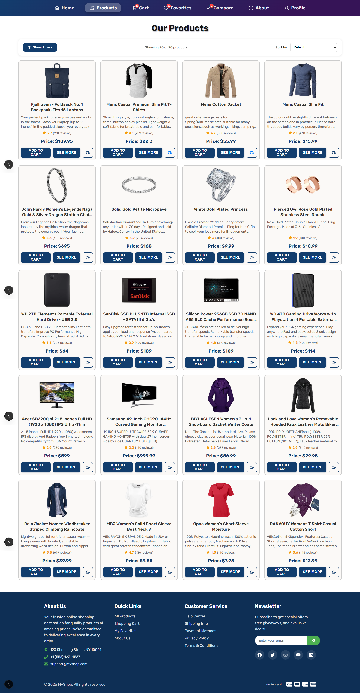

# 🛒 Premium E-Commerce Store

A modern, feature-rich e-commerce web application built with **Next.js 16**, **React 19**, and **Redux Toolkit**. This application provides a seamless shopping experience with a beautiful UI, responsive design and robust state management.


---

## 📸 Screenshot

<div align="center">
  
  <p><em>Products page showcasing the product catalog with filtering, sorting and cart functionality</em></p>
</div>

---

## ✨ Features

| Feature                    | Description                                                          |
| -------------------------- | -------------------------------------------------------------------- |
| 🏠 **Home Page**           | Hero section, featured products, categories, testimonials, and stats |
| 🛍️ **Product Catalog**     | Browse all products with filtering and sorting capabilities          |
| 🔍 **Product Details**     | Detailed view with images, descriptions, ratings, and reviews        |
| 🛒 **Shopping Cart**       | Add, remove, update quantities with persistent state                 |
| ❤️ **Favorites**           | Save products to favorites for later                                 |
| ⚖️ **Compare**             | Compare multiple products side by side                               |
| 👤 **User Profile**        | User account management                                              |
| 🔐 **Authentication**      | Login and registration system                                        |
| 📱 **Responsive Design**   | Fully responsive across all devices                                  |
| 🔔 **Toast Notifications** | User-friendly feedback system                                        |

---

## 🗂️ Website Structure

```
🌐 MyApp E-Commerce
│
├── 🏠 Home (/)
│   ├── Hero Section
│   ├── Stats Overview
│   ├── Featured Products
│   ├── Categories
│   ├── Why Choose Us
│   └── Testimonials
│
├── 🛍️ Products (/products)
│   └── 📄 Product Details (/products/details/[id])
│
├── 🛒 Cart (/cart)
│
├── ❤️ Favorites (/favorites)
│
├── ⚖️ Compare (/compare)
│
├── 👤 Profile (/profile)
│
├── 🔐 Authentication
│   ├── Login (/login)
│   └── Register (/register)
│
├── ℹ️ About (/about)
│
└── 📋 Information Pages
    ├── Help Center (/help-center)
    ├── Shipping Info (/shipping-info)
    ├── Payment Methods (/payment-methods)
    ├── Privacy Policy (/privacy-policy)
    └── Terms & Conditions (/terms-conditions)
```

---

## 🛠️ Tech Stack

### Core

- **[Next.js 16](https://nextjs.org/)** - React framework with App Router
- **[React 19](https://react.dev/)** - UI library with latest features
- **[TypeScript 5](https://www.typescriptlang.org/)** - Type-safe JavaScript

### State Management

- **[Redux Toolkit](https://redux-toolkit.js.org/)** - Efficient Redux development
- **[React Redux](https://react-redux.js.org/)** - React bindings for Redux

### Forms & Validation

- **[React Hook Form](https://react-hook-form.com/)** - Performant form handling
- **[Yup](https://github.com/jquense/yup)** - Schema validation

### UI & Styling

- **[CSS Modules](https://github.com/css-modules/css-modules)** - Scoped component styles
- **[React Icons](https://react-icons.github.io/react-icons/)** - Icon library

---

## 🚀 Getting Started

### Prerequisites

- Node.js 18.17 or later
- npm, yarn, or pnpm

### Installation

1. **Clone the repository**

   ```bash
   git clone https://github.com/your-username/myapp.git
   cd myapp
   ```

2. **Install dependencies**

   ```bash
   npm install
   # or
   yarn install
   # or
   pnpm install
   ```

3. **Run the development server**

   ```bash
   npm run dev
   # or
   yarn dev
   # or
   pnpm dev
   ```

4. **Open in browser**

   Navigate to [http://localhost:3000](http://localhost:3000)

---

<div align="center">
  <p>Made with ❤️ using Next.js and React</p>
</div>
